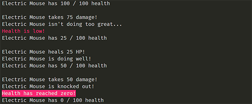

# 0x0C. C# - Delegates, Events

#### What you'll find here? This part of my learning process is about interfaces in C#.
- What are delegates and how to use them
- What are anonymous methods and how to use them
- What is multicasting
- What is the difference between delegates and interfaces
- What is a callback
- What are events and how to use them
- What is asynchronous programming

Here are the task I solve to answer those question and more. The solution to every task is on the file with the same name than the task.

My challenge for you is to try to solve all of this task and after see the way I did it.

All the main code would be in `main` directory, it must be at same directory of the task to work properly.

To see my solution you need to build the project, to do that you need to run `dotnet build` inside of the task directory.

To run a specific task run `dotnet run` inside of the task directory.

All of this code was me on .NET version 2.1, asked for Holberton School.

All your public classes and their members should have XML documentation tags

In your `.csproj` file, make sure you have the following line:
`<DocumentationFile>bin\$(Configuration)\$(TargetFramework)\$(AssemblyName).xml</DocumentationFile>`

All the intellectual property belongs to Holberton School.

## Tasks
#### 0. Universal health
Create a public class called Player with the following:

- Properties:
    - `name`: string
    - `maxHp`: float
    - `hp`: float
    - You should not be able to change or access the Player’s properties directly from the main file.
- Constructor:
    - Prototype: `public Player(string name, float maxHp)`
    - Assign parameters to properties accordingly
    - Default `name`: `Player`
    - Default `maxHp`: `100f`
    - `maxHp` must be greater than `0`, otherwise, set `maxHp` to the default value of `100f` and print `maxHp must be greater than 0. maxHp set to 100f by default..`
    - hp should be the same value as maxHp
- Method:
    - Prototype: `public void PrintHealth()`
    - Format: `<name> has <hp> / <maxHp> health`

#### 1. Damage delegation
Based on `0-universal_health`, create a delegate `CalculateHealth` that takes a float amount. Write two methods that follow the prototype of the `CalculateHealth` delegate:

- `public void TakeDamage(float damage)`
    - Prints `<name> takes <damage> damage!`
    - If `damage` is negative, the Player takes `0` damage and prints `<name> takes 0 damage!`
- `public void HealDamage(float heal)`
    - Prints `<name> heals <heal> HP!`
    - If `heal` is negative, the `Player` heals `0` HP and prints `<name> heals 0 HP!`

#### 2. Validation
Based on `1-damage_delegation`, inside the `TakeDamage()` and `HealDamage()` methods, calculate the new value of the Player’s `hp` but do not set the value of `hp` in these methods.
- If damage is taken, subtract `damage` from `hp`
- If health is healed, add `heal` to `hp`

Create a new method `ValidateHP()` that sets the new value of the Player’s `hp`:
- Prototype:` public void ValidateHP(float newHp)`
- If `newHp` is negative, set `hp` to `0`
- If `newHp` is larger than `maxHp`, set `hp` to the value of `maxHp`
- Otherwise, set `hp` to the value of `newHp`

In the `TakeDamage()` and `HealDamage()` methods, add a call to `ValidateHP()` and pass in the value calculated within that method.

#### 3. Modified behavior
Based on `2-validation`, outside of the `Player` class, create an enum `Modifier` with the values `Weak`, `Base`, `Strong`.

Outside of the `Player` class, create a delegate `CalculateModifier`:

- Prototype: `public delegate float CalculateModifier(float baseValue, Modifier modifier)`

Create a method `ApplyModifier` that follows the prototype of `CalculateModifier`.
- If `modifier` is `Weak`, return half of the base value
- If `modifier` is `Base`, return the base value
- If `modifier` is `Strong`, return 1.5 times the base value

#### 4. Create a new class
Based on `3-modified_behavior`, outside of the `Player` class, create a new class `CurrentHPArgs` that inherits from `EventArgs` with the following:

- Properties:
    - `currentHp`: public float that cannot be modified
- Constructor:
    - Takes a float `newHp` and sets it as `currentHp`‘s value
Within the `Player` class, create a new EventHandler of type `CurrentHPArgs` called `HPCheck`.

Create a new private property `status` of type string. In the constructor, set its default value as `<name> is ready to go!`

Create a new method `CheckStatus`.

- Prototype: `private void CheckStatus(object sender, CurrentHPArgs e)`
- Depending on the value of `currentHp`, set the Player’s `status` to the following and print it:
    - If the value is equal to `maxHp`, print:
        - `<name> is in perfect health!`
    - If the value is between ½ of maxHp (inclusive) and maxHp (exclusive), print:
        - `<name> is doing well!`
    - If the value is between ¼ of `maxHp` (inclusive) and ½ of maxHp (exclusive), print:
        - `<name> isn't doing too great...`
    - If the value is between 0 (exclusive) and ¼ of `maxHp` (exclusive), print:
        - `<name> needs help!`
    - If the value is 0, print:
        - `<name> is knocked out!`

Within the `Player` constructor, assign `CheckStatus` to the `HPCheck` EventHandler so that when `HPCheck` is called, it triggers `CheckStatus`.

In `ValidateHP()`, trigger the `HPCheck` event and pass `hp` as the CurrentHPArgs value.

#### 5. Current HP
Based on `4-check_yourself`, create a new method `HPValueWarning` inside the `Player` class:
- Prototype: `private void HPValueWarning(object sender, CurrentHPArgs e)`
- If the value of `e`‘s `currentHp` is 0, print `Health has reached zero!`
- Otherwise, print `Health is low!`
- Optionally, change the colors of the console font or background when the warnings are printed:

Create a method called `OnCheckStatus()` that takes an object of CurrentHPArgs as a parameter and returns nothing. This method should check if `e`’s `currentHp` is less than ¼ of `maxHp`. If it is, assign `HPValueWarning` to the `HPCheck` EventHandler.

Within `OnCheckStatus()`, call `HPCheck` with the Player object and `e`.

Replace the call to `HPCheck()` in `ValidateHP()` with a call to `OnCheckStatus()`.
